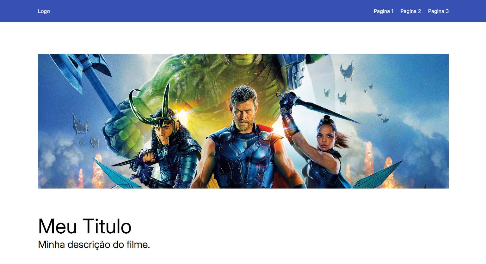
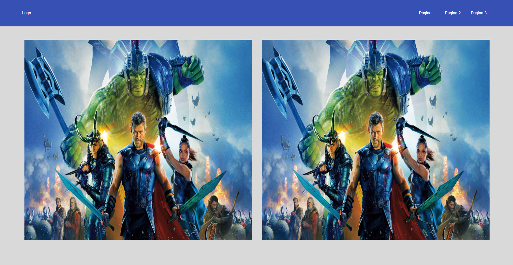
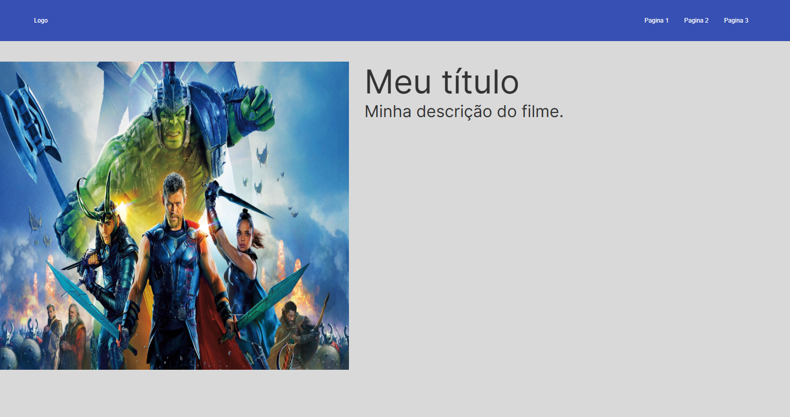

# senai-dev-front-jul25
Repositorio criado para guardar os arquivos do curso de dev-front

## LANDINGPAGEs do Projeto

Este repositório contém três versões de landing pages desenvolvidas durante o curso:

### 1. LANDINGPAGE
- Estrutura simples com menu no topo e área principal com título e descrição.
- Arquivos: `index.html`, `style.css`, imagens em `assests/`.
- Exemplo de uso de `<header>`, `<main>` e classes para organização visual.

### 2. LANDINGPAGE-2
- Menu horizontal com logo e páginas, layout com duas imagens lado a lado.
- Arquivos: `index.html`, `style.css`, imagens em `assests/`.
- Demonstração de grid/flexbox para imagens e menu.

### 3. LANDINGPAGE-3
- Menu horizontal, logo, páginas e área principal com imagem, título e descrição.
- Arquivos: `index.html`, `style.css`, imagens em `assests/`.
- Exemplo de separação entre imagem e texto na área principal.

Cada pasta possui seu próprio CSS e HTML, facilitando testes e aprendizado de diferentes estruturas de landing page.

---

Para visualizar cada página, abra o arquivo `index.html` correspondente em seu navegador.

